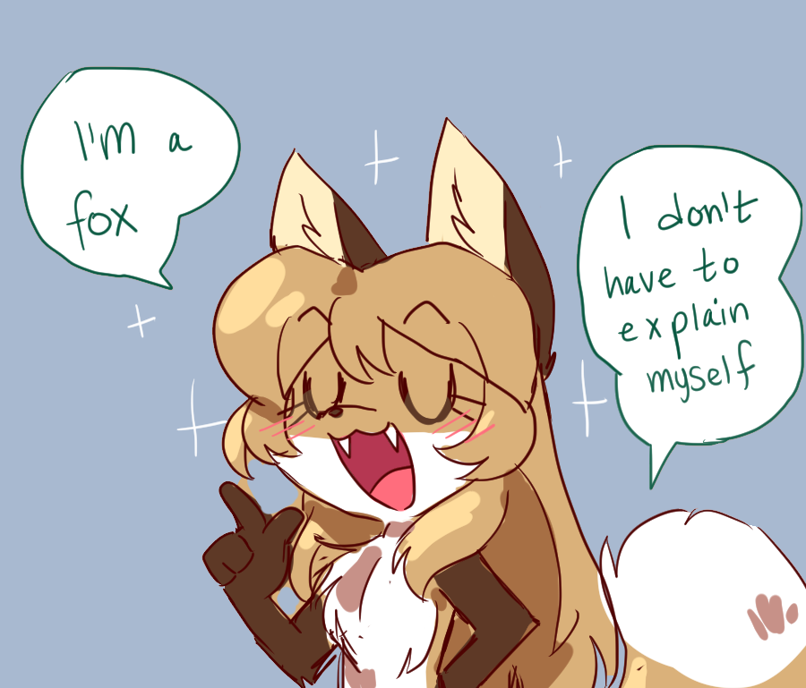
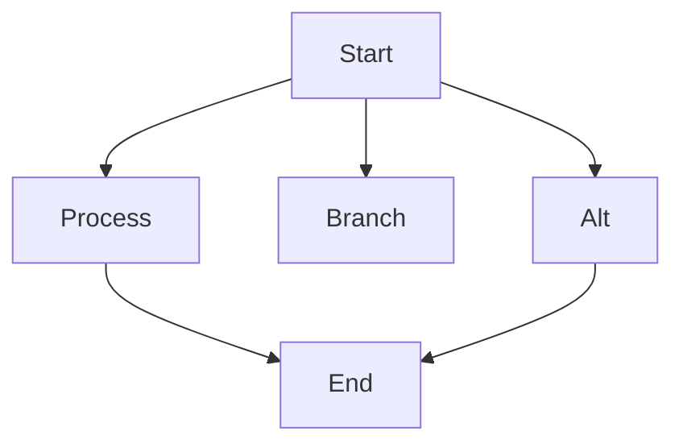
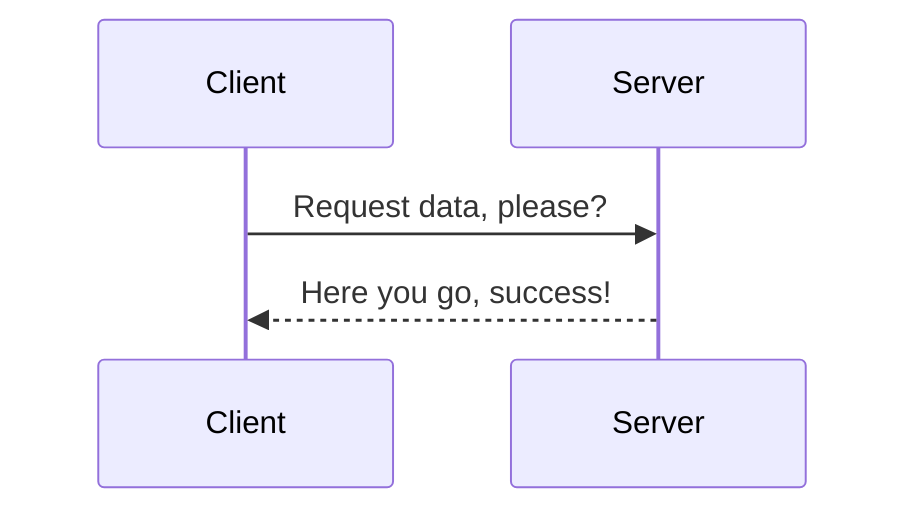
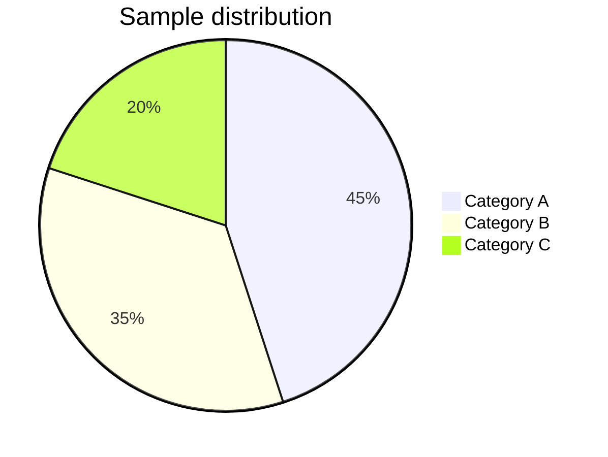
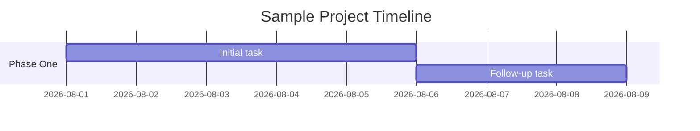
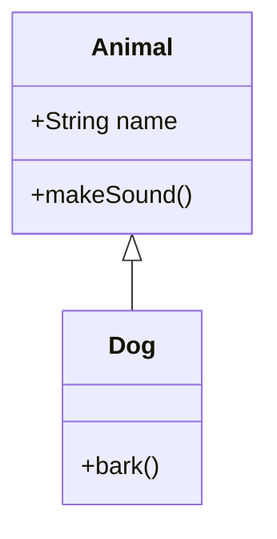

# Text
Lorem ipsum dolor sit amet, consectetur adipiscing elit. Nulla ullamcorper, lorem in facilisis tristique, mauris lacus consequat libero,
eget pellentesque metus ante lobortis nibh. Suspendisse potenti. Sed volutpat, arcu ac pharetra viverra, tortor neque tincidunt diam,
sed blandit ante eros quis ante. In accumsan tellus vel dignissim venenatis. Donec posuere dolor vel auctor luctus. Cras quis
consectetur ligula, non rutrum augue. Ut maximus ultricies leo quis lacinia. Proin dapibus dui sit amet felis maximus sodales.
Quisque aliquet augue eget leo sollicitudin imperdiet. Vivamus commodo libero ac tristique egestas. Ut in bibendum ipsum,
vitae varius dolor. Fusce eu nisl et nunc dignissim venenatis.


# Image



# Text Edge Cases
Escaped characters: \*asterisk\*, \`backtick\`, \_underscore\_

Long unbroken string: Supercalifragilisticexpialidocioussuperlongwordwithoutanybreaksatall

Hard line break test:
The quick brown fox jumps over the lazy dog.
Pack my box with five dozen liquor jugs.

Soft wrap test:
The quick brown fox jumps over the lazy dog while packing five dozen liquor jugs, then wonders why the sentence keeps going on and on without any obvious end in sight.

Inline HTML: Water<sub>2</sub>O, x<sup>2</sup>, press <kbd>Ctrl</kbd>+<kbd>C</kbd>, this is <mark>highlighted text</mark>.


# Formatting
- List item 1
    - List item 2
    - [x] Task item 1
    - [ ] Todo Task item 2
- List item 3

1. First step
2. Second step
    1. Nested step A
    2. Nested step B
3. Third step


`inline code` *italic text*, **bold text** ~~strikethrough~~. [link :3](https://www.example.com)
> Ut iaculis, tortor nec ornare scelerisque, urna libero luctus urna, sed rhoncus lorem neque vitae ligula
> > neque vitae ligula. Phasellus imperdiet lorem ut libero bibendum ultricies. Integer maximus tincidunt urna et placerat.


# Headings
# H1 Heading
## H2 Heading
### H3 Heading
#### H4 Heading
##### H5 Heading
###### H6 Heading


# Code blocks
```rust
#[derive(Debug, Clone, Copy)]
#[derive(PartialEq, Eq, Hash)]
pub enum Cursor {
    Default, Pointer,
    Hidden, Text, Crosshair,
}

impl Default for Cursor {
    fn default() -> Self {
        return Cursor::Default;
    }
}
```


# Math
Inline math: $b \pm \frac{b^2 - 4ac}{2a}$ yipee!
$$
L_o(p, \omega_o) = L_e(p, \omega_o) + \int_{\Omega^+} f_r(p, \omega_i, \omega_o) \, L_i(p, \omega_i) \, (n \cdot \omega_i) \, d\omega_i
$$

Matrix:
$$
A = \begin{bmatrix} 1 & 2 \\ 3 & 4 \end{bmatrix}
$$

Multi-line aligned equations:
$$
\begin{aligned}
x &= y + 1 \\
y &= z - 2
\end{aligned}
$$

Greek letters and symbols inline: $\alpha, \beta, \gamma, \sum_{i=1}^{n} i, \infty, \sqrt{2}$


# Tables

## Basic table
| Name | Role | Score |
| ----- | ----- | ----- |
| Alice | Admin | 90 |
| Bob   | User  | 75 |

## Column alignment
| Name | Role | Score |
| :--- | :----: | ----: |
| Alice | Admin | 90 |
| Bob   | User  | 75 |

## Empty cells
| Name | Role | Score |
| --- | --- | --- |
| Alice | Admin | |
| Bob   |      | 75 |
|       | User | — |


# Graphs

## Broken graph
```mermaid
  graph T;
      Start-->Process;
      Start-->Branch;
      Process-->End;
      Alt-->End;
      Start-->Alt;
```

## Flowchart


## Sequence diagram


## Pie chart


## Gantt chart


## Class diagram



### Footnotes
Lorem ipsum dolor sit amet, consectetur adipiscing elit.[^1]

[^1]: Sed do eiusmod tempor incididunt ut labore et dolore magna aliqua.

