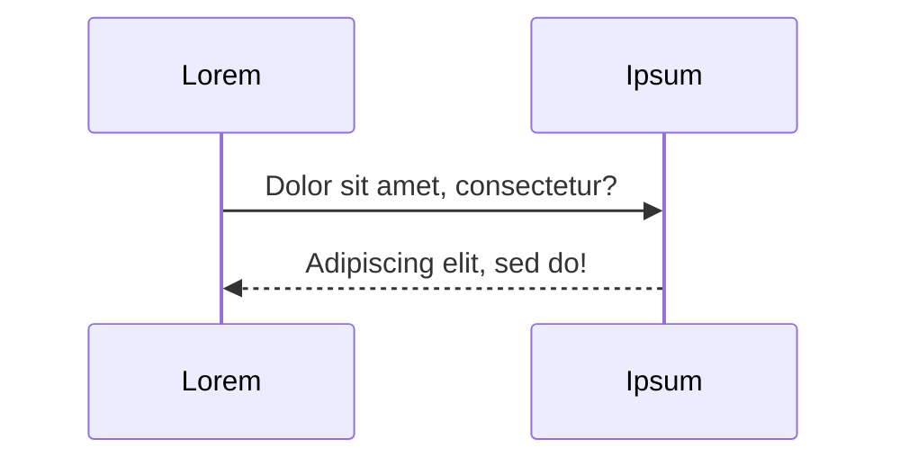
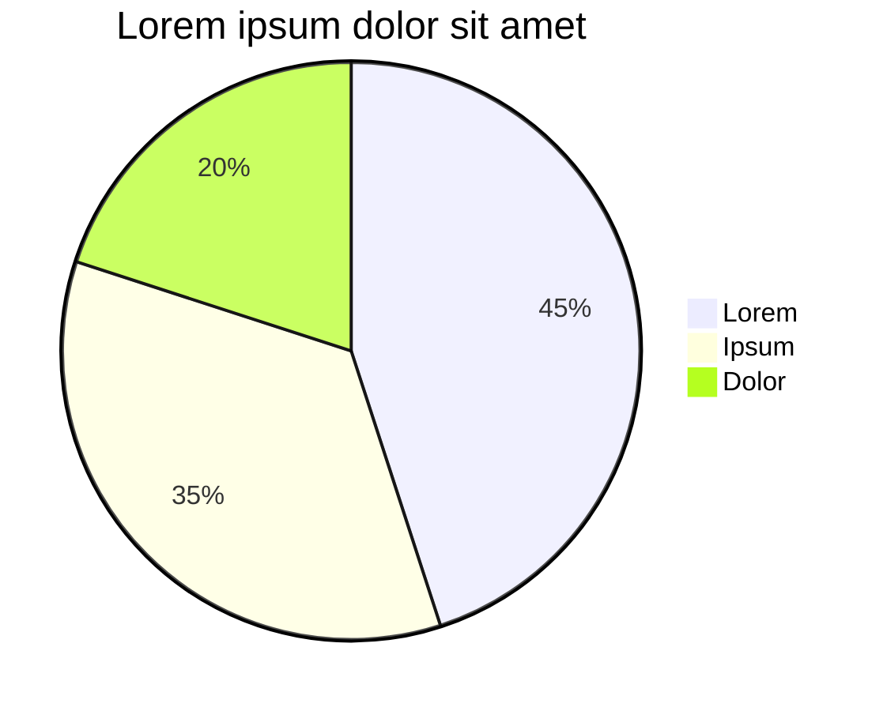
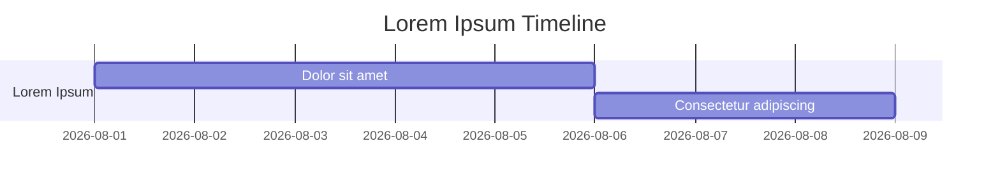
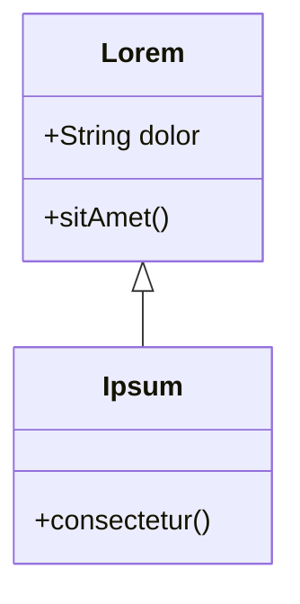

# Text
Lorem ipsum dolor sit amet, consectetur adipiscing elit. Ut iaculis, tortor nec ornare scelerisque, urna libero luctus urna, sed rhoncus lorem
neque vitae ligula. Phasellus imperdiet lorem ut libero bibendum ultricies. Integer maximus tincidunt urna et placerat. In posuere tempor massa,


# Text Edge Cases

Escaped characters: \*lorem ipsum\*, \`dolor sit amet\`, \_consectetur\_

Long unbroken string: Loremipsumdolorsitametconsecteturadipiscingelitseddoeiusmodtemporincididuntutloreetdoloremagnaaliqua

Hard line break test:
Lorem ipsum dolor sit amet, consectetur adipiscing elit.
Sed do eiusmod tempor incididunt ut labore et dolore magna aliqua.

Soft wrap test:
Lorem ipsum dolor sit amet, consectetur adipiscing elit, sed do eiusmod tempor incididunt ut labore et dolore magna aliqua ut enim ad minim veniam quis nostrud.

Inline HTML: Lorem<sub>ipsum</sub>, dolor<sup>sit</sup>, press <kbd>Lorem</kbd>+<kbd>Ipsum</kbd>, this is <mark>lorem ipsum dolor</mark>.


# Formatting
- List item 1
    - List item 2
    - [x] Task item 1
    - [ ] Todo Task item 2
- List item 3

`Lorem ipsum dolor` *sit amet*, **consectetur adipiscing** ~~elit~~. [:3](https://www.example.com)
> Ut iaculis, tortor nec ornare scelerisque, urna libero luctus urna, sed rhoncus lorem neque vitae ligula
> > neque vitae ligula. Phasellus imperdiet lorem ut libero bibendum ultricies. Integer maximus tincidunt urna et placerat.


# Code blocks
```rust
#[derive(Debug, Clone, Copy)]
#[derive(PartialEq, Eq, Hash)]
pub enum Cursor {
    Default, Pointer,
    Hidden, Text, Crosshair,
}

impl Default for Cursor {
    fn default() -> Self {
        return Cursor::Default;
    }
}
```


# Math
Inline math: $b \pm \frac{b^2 - 4ac}{2a}$ yipee!
$$
L_o(p, \omega_o) = L_e(p, \omega_o) + \int_{\Omega^+} f_r(p, \omega_i, \omega_o) \, L_i(p, \omega_i) \, (n \cdot \omega_i) \, d\omega_i
$$


# Tables

## Basic table
| Lorem | Ipsum | Dolor |
| ----- | ----- | ----- |
|   A   |   B   |   C   |
|   D   |   E   |   F   |

## Column alignment
| Lorem | Ipsum | Dolor |
| :--- | :----: | ----: |
| sit    |   amet    |     123 |
| consectetur adipiscing | elit | 456 |

## Long text and empty cells
| Lorem | Ipsum | Dolor |
| --- | --- | --- |
| Sit amet | Lorem ipsum dolor sit amet, consectetur adipiscing elit, sed do eiusmod tempor incididunt ut labore et dolore magna aliqua ut enim ad minim veniam. | |
| Consectetur | | Sed do eiusmod |
| | Adipiscing elit | — |


# Graphs

## Flowchart
```mermaid
  graph T;
      Lorem-->Ipsum;
      Lorem-->Dolor;
      Ipsum-->Dolor;
      Sit-->Dolor;
      Lorem-->Sit;
```

## Sequence diagram


## Pie chart


## Gantt chart


## Class diagram



### Footnotes
Lorem ipsum dolor sit amet, consectetur adipiscing elit.[^1]

[^1]: Sed do eiusmod tempor incididunt ut labore et dolore magna aliqua.

